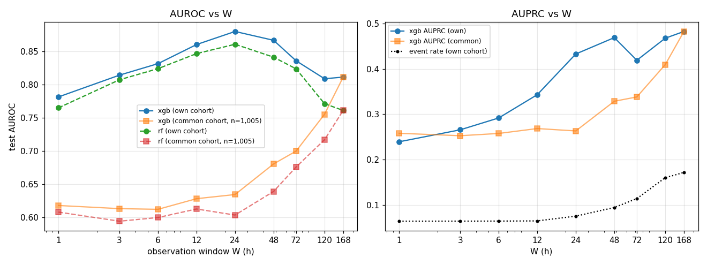

# Early-window prediction of death (observe first W hours, predict the stay outcome)

## W = 1 h
- stays train/val/test = 35,099/7,603/7,484; event rate 0.065 (test); excluded: 0 events and 90 discharges inside the window; 92 features
| model | val AUROC | test AUROC | test AUPRC | death ≤24h after window | 24–72h | >72h |
|---|---|---|---|---|---|---|
| xgb | 0.749 | 0.782 | 0.240 | — (n=6) | 0.819 (n=171) | 0.763 (n=309) |
| rf | 0.738 | 0.765 | 0.223 | — (n=6) | 0.802 (n=171) | 0.747 (n=309) |

top features (xgb gain): FIO2___min 42, FIO2___last 29, FIO2___max 24, FIO2___count 22, FIO2___mean 20, RR 회/min__mean 18, height cm__count 17, age 17, RR 회/min__last 17, Base Excess__max 16
top features (rf importance): age 0.064, RR 회/min__mean 0.045, RR 회/min__last 0.039, RR 회/min__max 0.037, FIO2___count 0.036, RR 회/min__min 0.033, SBP mmHg__min 0.030, FIO2___min 0.027, FIO2___mean 0.024, Base Excess__max 0.023

## W = 3 h
- stays train/val/test = 35,029/7,585/7,472; event rate 0.065 (test); excluded: 0 events and 190 discharges inside the window; 92 features
| model | val AUROC | test AUROC | test AUPRC | death ≤24h after window | 24–72h | >72h |
|---|---|---|---|---|---|---|
| xgb | 0.797 | 0.815 | 0.266 | 0.803 (n=16) | 0.855 (n=170) | 0.792 (n=300) |
| rf | 0.783 | 0.808 | 0.248 | 0.789 (n=16) | 0.842 (n=170) | 0.789 (n=300) |

top features (xgb gain): FIO2___last 163, FIO2___min 129, Base Excess__mean 75, Base Excess__max 72, FIO2___max 69, Base Excess__min 69, Base Excess__last 66, RR 회/min__min 65, Base Excess__count 65, RR 회/min__mean 65
top features (rf importance): RR 회/min__mean 0.042, FIO2___count 0.042, age 0.041, RR 회/min__min 0.034, Base Excess__max 0.032, RR 회/min__max 0.030, Base Excess__mean 0.029, Base Excess__last 0.028, RR 회/min__last 0.027, FIO2___last 0.025

## W = 6 h
- stays train/val/test = 34,956/7,569/7,453; event rate 0.065 (test); excluded: 0 events and 298 discharges inside the window; 92 features
| model | val AUROC | test AUROC | test AUPRC | death ≤24h after window | 24–72h | >72h |
|---|---|---|---|---|---|---|
| xgb | 0.826 | 0.832 | 0.292 | 0.899 (n=26) | 0.868 (n=166) | 0.805 (n=294) |
| rf | 0.811 | 0.824 | 0.277 | 0.875 (n=26) | 0.858 (n=166) | 0.801 (n=294) |

top features (xgb gain): Base Excess__max 142, FIO2___last 141, FIO2___max 135, FIO2___min 133, Base Excess__mean 114, FIO2___mean 89, RR 회/min__min 85, RR 회/min__mean 81, FIO2___count 79, height cm__count 76
top features (rf importance): RR 회/min__mean 0.040, Base Excess__max 0.039, age 0.037, FIO2___count 0.035, RR 회/min__min 0.033, Base Excess__mean 0.031, Base Excess__min 0.028, Base Excess__last 0.027, FIO2___mean 0.025, FIO2___last 0.024

## W = 12 h
- stays train/val/test = 34,764/7,523/7,409; event rate 0.066 (test); excluded: 0 events and 580 discharges inside the window; 92 features
| model | val AUROC | test AUROC | test AUPRC | death ≤24h after window | 24–72h | >72h |
|---|---|---|---|---|---|---|
| xgb | 0.844 | 0.861 | 0.343 | 0.924 (n=50) | 0.897 (n=147) | 0.831 (n=289) |
| rf | 0.830 | 0.847 | 0.323 | 0.894 (n=50) | 0.885 (n=147) | 0.819 (n=289) |

top features (xgb gain): Base Excess__mean 29, FIO2___last 28, FIO2___min 27, Base Excess__min 23, FIO2___max 22, Base Excess__last 22, DBP mmHg__count 21, RR 회/min__mean 17, Base Excess__max 16, FIO2___mean 15
top features (rf importance): FIO2___count 0.036, RR 회/min__mean 0.035, Base Excess__mean 0.034, Base Excess__min 0.032, Base Excess__count 0.032, age 0.031, FIO2___mean 0.030, RR 회/min__min 0.027, Base Excess__last 0.026, Base Excess__max 0.026

## W = 24 h
- stays train/val/test = 30,393/6,564/6,390; event rate 0.076 (test); excluded: 1 events and 6928 discharges inside the window; 92 features
| model | val AUROC | test AUROC | test AUPRC | death ≤24h after window | 24–72h | >72h |
|---|---|---|---|---|---|---|
| xgb | 0.866 | 0.880 | 0.433 | 0.946 (n=100) | 0.903 (n=110) | 0.848 (n=276) |
| rf | 0.852 | 0.861 | 0.366 | 0.919 (n=100) | 0.885 (n=110) | 0.831 (n=276) |

top features (xgb gain): FIO2___count 58, Base Excess__min 55, FIO2___last 41, Flow rate L/min__last 41, Base Excess__mean 33, FIO2___max 32, Base Excess__last 30, FIO2___min 26, Flow rate L/min__mean 20, RR 회/min__mean 20
top features (rf importance): FIO2___count 0.048, Base Excess__min 0.037, Base Excess__mean 0.035, Flow rate L/min__count 0.033, RR 회/min__mean 0.031, Base Excess__count 0.031, FIO2___mean 0.026, Base Excess__last 0.026, age 0.022, Base Excess__max 0.022

## W = 48 h
- stays train/val/test = 19,259/4,179/4,063; event rate 0.095 (test); excluded: 652 events and 22123 discharges inside the window; 92 features
| model | val AUROC | test AUROC | test AUPRC | death ≤24h after window | 24–72h | >72h |
|---|---|---|---|---|---|---|
| xgb | 0.848 | 0.867 | 0.469 | 0.931 (n=75) | 0.893 (n=70) | 0.840 (n=241) |
| rf | 0.828 | 0.842 | 0.375 | 0.881 (n=75) | 0.875 (n=70) | 0.820 (n=241) |

top features (xgb gain): FIO2___count 107, Flow rate L/min__last 53, Base Excess__min 45, Base Excess__last 45, total_output__mean 32, FIO2___max 32, Base Excess__count 25, RR 회/min__mean 24, total_output__max 24, Base Excess__mean 23
top features (rf importance): FIO2___count 0.065, Flow rate L/min__count 0.041, Base Excess__count 0.031, total_output__mean 0.030, Base Excess__min 0.030, Base Excess__last 0.028, Flow rate L/min__last 0.026, Base Excess__mean 0.026, RR 회/min__mean 0.025, total_output__last 0.023

## W = 72 h
- stays train/val/test = 12,960/2,830/2,715; event rate 0.115 (test); excluded: 1119 events and 30652 discharges inside the window; 92 features
| model | val AUROC | test AUROC | test AUPRC | death ≤24h after window | 24–72h | >72h |
|---|---|---|---|---|---|---|
| xgb | 0.841 | 0.836 | 0.419 | 0.893 (n=35) | 0.836 (n=77) | 0.826 (n=199) |
| rf | 0.807 | 0.824 | 0.379 | 0.880 (n=35) | 0.820 (n=77) | 0.816 (n=199) |

top features (xgb gain): Flow rate L/min__last 110, FIO2___count 94, io_balance__last 64, Base Excess__min 45, Base Excess__last 45, Base Excess__count 43, total_output__mean 41, Flow rate L/min__count 35, RR 회/min__mean 34, HR 회/min__last 33
top features (rf importance): io_balance__last 0.048, FIO2___count 0.048, Flow rate L/min__count 0.038, Flow rate L/min__last 0.035, total_output__mean 0.026, RR 회/min__mean 0.025, Base Excess__min 0.024, Base Excess__count 0.023, total_output__last 0.023, Base Excess__mean 0.022

## W = 120 h
- stays train/val/test = 7,295/1,599/1,501; event rate 0.161 (test); excluded: 1708 events and 38173 discharges inside the window; 92 features
| model | val AUROC | test AUROC | test AUPRC | death ≤24h after window | 24–72h | >72h |
|---|---|---|---|---|---|---|
| xgb | 0.806 | 0.809 | 0.467 | 0.832 (n=42) | 0.835 (n=49) | 0.794 (n=150) |
| rf | 0.757 | 0.772 | 0.383 | 0.762 (n=42) | 0.801 (n=49) | 0.765 (n=150) |

top features (xgb gain): io_balance__last 60, Base Excess__last 48, Base Excess__min 27, total_output__mean 25, Flow rate L/min__last 24, BT ℃__min 19, FIO2___last 19, Mean ABP mmHg__last 19, Mean ABP mmHg__min 18, FIO2___count 18
top features (rf importance): io_balance__last 0.068, total_output__mean 0.045, io_balance__min 0.038, Base Excess__last 0.032, FIO2___count 0.030, Base Excess__min 0.027, Flow rate L/min__count 0.026, io_balance__mean 0.025, Base Excess__mean 0.024, Flow rate L/min__last 0.024

## W = 168 h
- stays train/val/test = 4,908/1,113/1,005; event rate 0.172 (test); excluded: 2133 events and 41117 discharges inside the window; 92 features
| model | val AUROC | test AUROC | test AUPRC | death ≤24h after window | 24–72h | >72h |
|---|---|---|---|---|---|---|
| xgb | 0.787 | 0.812 | 0.482 | 0.843 (n=23) | 0.811 (n=41) | 0.805 (n=109) |
| rf | 0.731 | 0.761 | 0.419 | 0.773 (n=23) | 0.800 (n=41) | 0.744 (n=109) |

top features (xgb gain): Base Excess__last 35, io_balance__last 33, total_output__mean 26, BT ℃__min 22, Flow rate L/min__last 22, Flow rate L/min__count 21, Base Excess__mean 21, io_balance__min 21, total_output__count 21, FIO2___last 20
top features (rf importance): io_balance__last 0.047, io_balance__mean 0.040, io_balance__min 0.035, total_output__mean 0.032, Base Excess__last 0.030, Base Excess__mean 0.025, age 0.024, BT ℃__min 0.022, total_output__min 0.021, BT ℃__mean 0.020

## Saturation (AUROC vs W)
|   W |   n_test |   event_rate |   xgb_auroc |   rf_auroc |   xgb_auprc |   n_common |   xgb_auroc_common |   rf_auroc_common |   xgb_auprc_common |
|----:|---------:|-------------:|------------:|-----------:|------------:|-----------:|-------------------:|------------------:|-------------------:|
|   1 | 7484.000 |        0.065 |       0.782 |      0.765 |       0.240 |   1005.000 |              0.618 |             0.608 |              0.258 |
|   3 | 7472.000 |        0.065 |       0.815 |      0.808 |       0.266 |   1005.000 |              0.613 |             0.594 |              0.253 |
|   6 | 7453.000 |        0.065 |       0.832 |      0.824 |       0.292 |   1005.000 |              0.612 |             0.600 |              0.258 |
|  12 | 7409.000 |        0.066 |       0.861 |      0.847 |       0.343 |   1005.000 |              0.628 |             0.613 |              0.269 |
|  24 | 6390.000 |        0.076 |       0.880 |      0.861 |       0.433 |   1005.000 |              0.634 |             0.604 |              0.263 |
|  48 | 4063.000 |        0.095 |       0.867 |      0.842 |       0.469 |   1005.000 |              0.681 |             0.639 |              0.329 |
|  72 | 2715.000 |        0.115 |       0.836 |      0.824 |       0.419 |   1005.000 |              0.700 |             0.676 |              0.338 |
| 120 | 1501.000 |        0.161 |       0.809 |      0.772 |       0.467 |   1005.000 |              0.755 |             0.717 |              0.409 |
| 168 | 1005.000 |        0.172 |       0.812 |      0.761 |       0.482 |   1005.000 |              0.812 |             0.761 |              0.482 |

