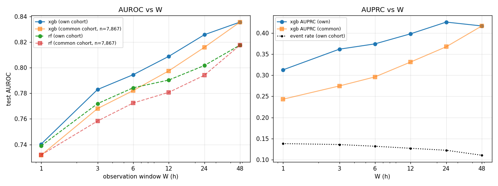

# Early-window prediction of death_28d (observe the first W hours of the ICU stay)

## W = 1 h
- stays train/val/test = 36,825/7,906/8,119; event rate 0.138 (test); excluded because the outcome is known inside the window: 579 positive / 0 negative; 92 features
| model | val AUROC | test AUROC | test AUPRC | death ≤24h after window | 24–72h | >72h |
|---|---|---|---|---|---|---|
| xgb | 0.754 | 0.740 | 0.313 | 0.781 (n=156) | 0.741 (n=197) | 0.732 (n=768) |
| rf | 0.742 | 0.739 | 0.309 | 0.781 (n=156) | 0.737 (n=197) | 0.731 (n=768) |

top features (xgb gain): FIO2___last 58, age 56, Base Excess__max 43, RR 회/min__max 38, RR 회/min__mean 33, Base Excess__last 29, Base Excess__count 25, height cm__last 25, SBP mmHg__min 24, height cm__mean 23
top features (rf importance): age 0.180, RR 회/min__mean 0.046, RR 회/min__max 0.039, RR 회/min__min 0.035, RR 회/min__last 0.034, SBP mmHg__min 0.025, SBP mmHg__last 0.023, Mean BP mmHg__min 0.022, Mean BP mmHg__mean 0.019, SBP mmHg__mean 0.019

## W = 3 h
- stays train/val/test = 36,725/7,892/8,098; event rate 0.136 (test); excluded because the outcome is known inside the window: 714 positive / 0 negative; 92 features
| model | val AUROC | test AUROC | test AUPRC | death ≤24h after window | 24–72h | >72h |
|---|---|---|---|---|---|---|
| xgb | 0.793 | 0.783 | 0.362 | 0.858 (n=151) | 0.805 (n=189) | 0.763 (n=760) |
| rf | 0.776 | 0.772 | 0.338 | 0.842 (n=151) | 0.789 (n=189) | 0.754 (n=760) |

top features (xgb gain): age 18, RR 회/min__mean 12, RR 회/min__min 12, FIO2___min 12, FIO2___last 12, SBP mmHg__min 11, FIO2___max 11, FIO2___mean 10, Base Excess__max 10, Base Excess__count 9
top features (rf importance): age 0.126, RR 회/min__mean 0.054, RR 회/min__min 0.040, RR 회/min__max 0.038, Mean BP mmHg__min 0.027, RR 회/min__last 0.026, SBP mmHg__min 0.026, FIO2___count 0.026, Mean BP mmHg__mean 0.019, SBP mmHg__mean 0.019

## W = 6 h
- stays train/val/test = 36,589/7,874/8,060; event rate 0.132 (test); excluded because the outcome is known inside the window: 906 positive / 0 negative; 92 features
| model | val AUROC | test AUROC | test AUPRC | death ≤24h after window | 24–72h | >72h |
|---|---|---|---|---|---|---|
| xgb | 0.802 | 0.795 | 0.374 | 0.861 (n=129) | 0.805 (n=183) | 0.780 (n=750) |
| rf | 0.783 | 0.784 | 0.348 | 0.843 (n=129) | 0.805 (n=183) | 0.769 (n=750) |

top features (xgb gain): RR 회/min__mean 45, age 42, SBP mmHg__min 34, Base Excess__mean 33, FIO2___mean 27, FIO2___last 27, FIO2___count 25, FIO2___max 24, height cm__last 24, Base Excess__count 23
top features (rf importance): age 0.113, RR 회/min__mean 0.054, RR 회/min__min 0.041, RR 회/min__max 0.028, FIO2___count 0.024, SBP mmHg__min 0.023, Base Excess__count 0.023, Mean BP mmHg__min 0.022, BT ℃__mean 0.022, BT ℃__min 0.021

## W = 12 h
- stays train/val/test = 36,390/7,831/8,016; event rate 0.127 (test); excluded because the outcome is known inside the window: 1192 positive / 0 negative; 92 features
| model | val AUROC | test AUROC | test AUPRC | death ≤24h after window | 24–72h | >72h |
|---|---|---|---|---|---|---|
| xgb | 0.814 | 0.809 | 0.398 | 0.878 (n=119) | 0.836 (n=165) | 0.791 (n=734) |
| rf | 0.794 | 0.790 | 0.350 | 0.849 (n=119) | 0.814 (n=165) | 0.776 (n=734) |

top features (xgb gain): age 71, FIO2___min 67, RR 회/min__mean 65, RR 회/min__min 53, FIO2___max 51, FIO2___count 46, height cm__mean 43, SBP mmHg__min 42, FIO2___mean 40, Base Excess__count 40
top features (rf importance): age 0.105, RR 회/min__mean 0.047, RR 회/min__min 0.038, BT ℃__mean 0.028, FIO2___count 0.023, RR 회/min__max 0.022, BT ℃__min 0.021, Base Excess__count 0.021, Base Excess__mean 0.020, SBP mmHg__min 0.020

## W = 24 h
- stays train/val/test = 36,198/7,783/7,973; event rate 0.122 (test); excluded because the outcome is known inside the window: 1475 positive / 0 negative; 92 features
| model | val AUROC | test AUROC | test AUPRC | death ≤24h after window | 24–72h | >72h |
|---|---|---|---|---|---|---|
| xgb | 0.827 | 0.826 | 0.426 | 0.907 (n=106) | 0.862 (n=151) | 0.806 (n=718) |
| rf | 0.805 | 0.802 | 0.369 | 0.864 (n=106) | 0.846 (n=151) | 0.783 (n=718) |

top features (xgb gain): height cm__count 77, age 75, FIO2___max 75, total_output__max 61, FIO2___min 56, Flow rate L/min__last 54, FIO2___count 53, RR 회/min__mean 53, RR 회/min__min 52, total_output__min 52
top features (rf importance): age 0.093, RR 회/min__mean 0.041, FIO2___count 0.040, BT ℃__mean 0.031, total_output__mean 0.031, total_output__min 0.031, RR 회/min__min 0.030, total_output__last 0.027, total_output__max 0.026, Base Excess__mean 0.023

## W = 48 h
- stays train/val/test = 35,706/7,670/7,867; event rate 0.110 (test); excluded because the outcome is known inside the window: 2186 positive / 0 negative; 92 features
| model | val AUROC | test AUROC | test AUPRC | death ≤24h after window | 24–72h | >72h |
|---|---|---|---|---|---|---|
| xgb | 0.836 | 0.836 | 0.417 | 0.905 (n=97) | 0.861 (n=113) | 0.821 (n=659) |
| rf | 0.813 | 0.818 | 0.356 | 0.863 (n=97) | 0.849 (n=113) | 0.806 (n=659) |

top features (xgb gain): FIO2___count 72, HR 회/min__count 63, RR 회/min__count 39, total_output__mean 35, age 34, SpO2 %__count 31, Flow rate L/min__last 27, BT ℃__mean 25, io_balance__count 24, total_output__min 23
top features (rf importance): age 0.063, total_output__min 0.043, HR 회/min__count 0.040, FIO2___count 0.040, total_output__mean 0.039, SpO2 %__count 0.033, RR 회/min__count 0.030, total_output__last 0.028, BT ℃__mean 0.028, total_output__max 0.028

## Saturation (AUROC vs W)
|   W |   n_test |   event_rate |   xgb_auroc |   rf_auroc |   xgb_auprc |   n_common |   xgb_auroc_common |   rf_auroc_common |   xgb_auprc_common |
|----:|---------:|-------------:|------------:|-----------:|------------:|-----------:|-------------------:|------------------:|-------------------:|
|   1 | 8119.000 |        0.138 |       0.740 |      0.739 |       0.313 |   7867.000 |              0.732 |             0.732 |              0.243 |
|   3 | 8098.000 |        0.136 |       0.783 |      0.772 |       0.362 |   7867.000 |              0.768 |             0.758 |              0.275 |
|   6 | 8060.000 |        0.132 |       0.795 |      0.784 |       0.374 |   7867.000 |              0.782 |             0.772 |              0.296 |
|  12 | 8016.000 |        0.127 |       0.809 |      0.790 |       0.398 |   7867.000 |              0.798 |             0.781 |              0.331 |
|  24 | 7973.000 |        0.122 |       0.826 |      0.802 |       0.426 |   7867.000 |              0.816 |             0.794 |              0.367 |
|  48 | 7867.000 |        0.110 |       0.836 |      0.818 |       0.417 |   7867.000 |              0.836 |             0.818 |              0.417 |

## Label comparison on one cohort (`data/icu_allstays.csv`, same features, same patient split)

Test AUROC / AUPRC of the XGBoost model by observation window and endpoint:

| W (h) | in-ICU death | in-hospital death | 28-day death |
|---|---|---|---|
| 1 | 0.763 / 0.275 | 0.750 / 0.290 | 0.740 / 0.313 |
| 3 | 0.812 / 0.351 | 0.785 / 0.332 | 0.783 / 0.362 |
| 6 | 0.833 / 0.380 | 0.804 / 0.344 | 0.795 / 0.374 |
| 12 | 0.853 / 0.415 | 0.819 / 0.381 | 0.809 / 0.398 |
| **24** | **0.871 / 0.437** | **0.847 / 0.420** | **0.826 / 0.426** |
| 48 | 0.856 / 0.439 | 0.863 / 0.413 | 0.836 / 0.417 |

Test-set event rate at W = 24 h: 7.6 % (in-ICU, n = 6,908) / 9.7 % (in-hospital, n = 7,977) / 12.2 % (28-day, n = 7,973).
The in-ICU cohort is smaller because a stay that leaves the ICU alive has its label revealed inside the window and is
dropped; for the two mortality endpoints only stays that die inside the window are dropped.

At W = 24 h, deaths of the 28-day endpoint split by time to death: within 24 h after the window AUROC 0.907 (n = 106),
24–72 h 0.862 (n = 151), later than 72 h 0.806 (n = 718) — the endpoint's extra positives are mostly late deaths
(median 7.6 days after admission), which the first 24 h of data predicts least well.
