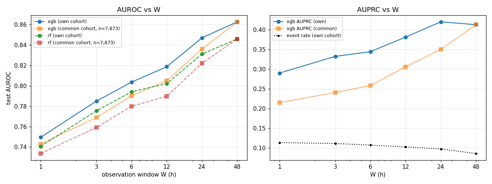

# Early-window prediction of hosp_death (observe the first W hours of the ICU stay)

## W = 1 h
- stays train/val/test = 36,826/7,907/8,120; event rate 0.113 (test); excluded because the outcome is known inside the window: 576 positive / 0 negative; 92 features
| model | val AUROC | test AUROC | test AUPRC | death ≤24h after window | 24–72h | >72h |
|---|---|---|---|---|---|---|
| xgb | 0.765 | 0.750 | 0.290 | 0.787 (n=153) | 0.729 (n=192) | 0.746 (n=573) |
| rf | 0.753 | 0.741 | 0.282 | 0.783 (n=153) | 0.732 (n=192) | 0.732 (n=573) |

top features (xgb gain): FIO2___last 28, height cm__max 24, FIO2___mean 23, RR 회/min__mean 22, height cm__mean 21, SBP mmHg__min 21, Base Excess__last 21, FIO2___max 20, FIO2___count 19, Base Excess__max 19
top features (rf importance): age 0.120, RR 회/min__mean 0.047, RR 회/min__max 0.043, RR 회/min__last 0.038, RR 회/min__min 0.035, FIO2___count 0.028, SBP mmHg__min 0.028, SBP mmHg__last 0.024, Mean BP mmHg__min 0.024, Base Excess__max 0.020

## W = 3 h
- stays train/val/test = 36,727/7,893/8,100; event rate 0.111 (test); excluded because the outcome is known inside the window: 709 positive / 0 negative; 92 features
| model | val AUROC | test AUROC | test AUPRC | death ≤24h after window | 24–72h | >72h |
|---|---|---|---|---|---|---|
| xgb | 0.807 | 0.785 | 0.332 | 0.850 (n=149) | 0.797 (n=184) | 0.764 (n=565) |
| rf | 0.794 | 0.775 | 0.315 | 0.842 (n=149) | 0.792 (n=184) | 0.752 (n=565) |

top features (xgb gain): RR 회/min__mean 39, Base Excess__max 37, FIO2___last 35, FIO2___mean 35, FIO2___max 34, Base Excess__mean 34, FIO2___min 28, SBP mmHg__min 25, RR 회/min__min 25, age 25
top features (rf importance): age 0.081, RR 회/min__mean 0.052, RR 회/min__min 0.042, RR 회/min__max 0.039, FIO2___count 0.037, SBP mmHg__min 0.029, RR 회/min__last 0.026, Mean BP mmHg__min 0.026, Base Excess__max 0.023, Base Excess__mean 0.023

## W = 6 h
- stays train/val/test = 36,593/7,875/8,064; event rate 0.107 (test); excluded because the outcome is known inside the window: 897 positive / 0 negative; 92 features
| model | val AUROC | test AUROC | test AUPRC | death ≤24h after window | 24–72h | >72h |
|---|---|---|---|---|---|---|
| xgb | 0.817 | 0.804 | 0.344 | 0.854 (n=129) | 0.820 (n=177) | 0.787 (n=556) |
| rf | 0.802 | 0.794 | 0.329 | 0.849 (n=129) | 0.816 (n=177) | 0.774 (n=556) |

top features (xgb gain): Base Excess__mean 48, Base Excess__max 44, height cm__max 43, RR 회/min__mean 39, FIO2___last 34, SBP mmHg__min 31, age 28, FIO2___mean 28, RR 회/min__min 26, FIO2___max 26
top features (rf importance): age 0.074, RR 회/min__mean 0.053, RR 회/min__min 0.038, FIO2___count 0.031, Base Excess__mean 0.030, RR 회/min__max 0.028, SBP mmHg__min 0.026, Base Excess__max 0.026, BT ℃__mean 0.022, SBP mmHg__mean 0.021

## W = 12 h
- stays train/val/test = 36,395/7,833/8,020; event rate 0.102 (test); excluded because the outcome is known inside the window: 1181 positive / 0 negative; 92 features
| model | val AUROC | test AUROC | test AUPRC | death ≤24h after window | 24–72h | >72h |
|---|---|---|---|---|---|---|
| xgb | 0.830 | 0.819 | 0.381 | 0.885 (n=118) | 0.842 (n=159) | 0.797 (n=541) |
| rf | 0.816 | 0.802 | 0.337 | 0.862 (n=118) | 0.827 (n=159) | 0.782 (n=541) |

top features (xgb gain): FIO2___min 67, Base Excess__mean 57, Base Excess__max 53, RR 회/min__mean 53, FIO2___max 52, FIO2___count 51, age 45, FIO2___last 45, RR 회/min__min 43, height cm__count 41
top features (rf importance): age 0.062, RR 회/min__mean 0.049, RR 회/min__min 0.036, Base Excess__mean 0.032, FIO2___count 0.031, Base Excess__max 0.028, BT ℃__mean 0.025, Base Excess__min 0.023, Base Excess__last 0.022, RR 회/min__max 0.022

## W = 24 h
- stays train/val/test = 36,210/7,785/7,977; event rate 0.097 (test); excluded because the outcome is known inside the window: 1457 positive / 0 negative; 92 features
| model | val AUROC | test AUROC | test AUPRC | death ≤24h after window | 24–72h | >72h |
|---|---|---|---|---|---|---|
| xgb | 0.842 | 0.847 | 0.420 | 0.918 (n=104) | 0.865 (n=145) | 0.828 (n=526) |
| rf | 0.826 | 0.831 | 0.382 | 0.889 (n=104) | 0.862 (n=145) | 0.811 (n=526) |

top features (xgb gain): FIO2___count 40, Base Excess__mean 31, Base Excess__last 30, Base Excess__min 25, Flow rate L/min__last 23, RR 회/min__mean 21, FIO2___last 21, FIO2___min 20, BT ℃__mean 18, age 18
top features (rf importance): FIO2___count 0.052, age 0.050, RR 회/min__mean 0.041, Base Excess__mean 0.032, Base Excess__min 0.029, BT ℃__mean 0.027, Base Excess__last 0.026, HR 회/min__max 0.024, total_output__mean 0.024, Base Excess__count 0.024

## W = 48 h
- stays train/val/test = 35,729/7,672/7,873; event rate 0.085 (test); excluded because the outcome is known inside the window: 2155 positive / 0 negative; 92 features
| model | val AUROC | test AUROC | test AUPRC | death ≤24h after window | 24–72h | >72h |
|---|---|---|---|---|---|---|
| xgb | 0.855 | 0.863 | 0.413 | 0.911 (n=94) | 0.854 (n=103) | 0.855 (n=474) |
| rf | 0.834 | 0.846 | 0.355 | 0.881 (n=94) | 0.837 (n=103) | 0.841 (n=474) |

top features (xgb gain): FIO2___count 98, HR 회/min__count 55, io_balance__count 34, SpO2 %__count 34, RR 회/min__count 29, Flow rate L/min__last 25, total_output__mean 24, Base Excess__mean 19, Base Excess__last 18, total_output__last 17
top features (rf importance): FIO2___count 0.056, HR 회/min__count 0.046, SpO2 %__count 0.040, total_output__min 0.032, RR 회/min__count 0.032, total_output__mean 0.030, age 0.026, total_output__last 0.026, RR 회/min__mean 0.024, BT ℃__mean 0.023

## Saturation (AUROC vs W)
|   W |   n_test |   event_rate |   xgb_auroc |   rf_auroc |   xgb_auprc |   n_common |   xgb_auroc_common |   rf_auroc_common |   xgb_auprc_common |
|----:|---------:|-------------:|------------:|-----------:|------------:|-----------:|-------------------:|------------------:|-------------------:|
|   1 | 8120.000 |        0.113 |       0.750 |      0.741 |       0.290 |   7873.000 |              0.743 |             0.734 |              0.215 |
|   3 | 8100.000 |        0.111 |       0.785 |      0.775 |       0.332 |   7873.000 |              0.769 |             0.759 |              0.241 |
|   6 | 8064.000 |        0.107 |       0.804 |      0.794 |       0.344 |   7873.000 |              0.790 |             0.780 |              0.258 |
|  12 | 8020.000 |        0.102 |       0.819 |      0.802 |       0.381 |   7873.000 |              0.805 |             0.790 |              0.306 |
|  24 | 7977.000 |        0.097 |       0.847 |      0.831 |       0.420 |   7873.000 |              0.836 |             0.822 |              0.350 |
|  48 | 7873.000 |        0.085 |       0.863 |      0.846 |       0.413 |   7873.000 |              0.863 |             0.846 |              0.413 |

