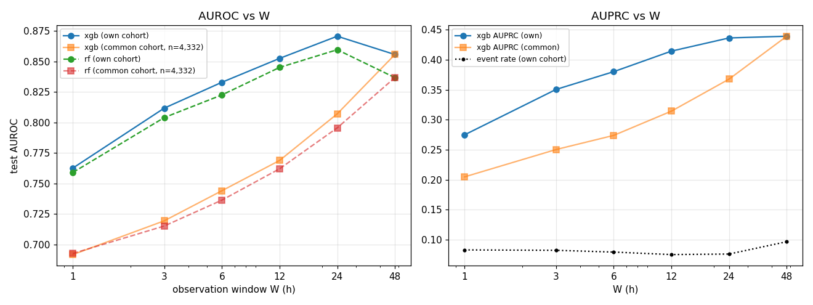

# Early-window prediction of icu_death (observe the first W hours of the ICU stay)

## W = 1 h
- stays train/val/test = 37,150/7,981/8,178; event rate 0.083 (test); excluded because the outcome is known inside the window: 21 positive / 99 negative; 92 features
| model | val AUROC | test AUROC | test AUPRC | death ≤24h after window | 24–72h | >72h |
|---|---|---|---|---|---|---|
| xgb | 0.777 | 0.763 | 0.275 | 0.810 (n=160) | 0.744 (n=176) | 0.750 (n=343) |
| rf | 0.767 | 0.759 | 0.265 | 0.790 (n=160) | 0.747 (n=176) | 0.751 (n=343) |

top features (xgb gain): FIO2___max 246, FIO2___mean 212, FIO2___last 199, FIO2___count 198, RR 회/min__mean 133, age 130, FIO2___min 124, Base Excess__mean 111, Base Excess__max 102, SBP mmHg__min 96
top features (rf importance): age 0.085, FIO2___count 0.045, RR 회/min__mean 0.044, RR 회/min__min 0.038, RR 회/min__max 0.036, Base Excess__max 0.033, RR 회/min__last 0.033, Base Excess__last 0.032, Base Excess__min 0.030, FIO2___min 0.028

## W = 3 h
- stays train/val/test = 37,023/7,947/8,159; event rate 0.082 (test); excluded because the outcome is known inside the window: 92 positive / 208 negative; 92 features
| model | val AUROC | test AUROC | test AUPRC | death ≤24h after window | 24–72h | >72h |
|---|---|---|---|---|---|---|
| xgb | 0.829 | 0.812 | 0.351 | 0.891 (n=169) | 0.794 (n=169) | 0.781 (n=334) |
| rf | 0.817 | 0.804 | 0.329 | 0.876 (n=169) | 0.786 (n=169) | 0.777 (n=334) |

top features (xgb gain): FIO2___last 15, FIO2___max 11, FIO2___mean 10, Base Excess__mean 10, Base Excess__min 9, FIO2___min 9, Base Excess__max 9, RR 회/min__mean 8, Base Excess__last 8, SBP mmHg__count 7
top features (rf importance): FIO2___count 0.054, age 0.047, RR 회/min__mean 0.045, RR 회/min__min 0.039, FIO2___last 0.035, Base Excess__max 0.034, FIO2___mean 0.034, RR 회/min__max 0.031, FIO2___min 0.030, Base Excess__mean 0.029

## W = 6 h
- stays train/val/test = 36,807/7,906/8,109; event rate 0.079 (test); excluded because the outcome is known inside the window: 273 positive / 334 negative; 92 features
| model | val AUROC | test AUROC | test AUPRC | death ≤24h after window | 24–72h | >72h |
|---|---|---|---|---|---|---|
| xgb | 0.843 | 0.833 | 0.380 | 0.901 (n=150) | 0.816 (n=169) | 0.811 (n=325) |
| rf | 0.824 | 0.823 | 0.324 | 0.881 (n=150) | 0.809 (n=169) | 0.803 (n=325) |

top features (xgb gain): FIO2___last 47, Base Excess__mean 43, Base Excess__min 39, Base Excess__max 36, FIO2___min 30, SBP mmHg__count 27, FIO2___max 24, Base Excess__last 24, RR 회/min__mean 23, height cm__count 21
top features (rf importance): FIO2___count 0.045, Base Excess__max 0.041, RR 회/min__mean 0.041, age 0.038, FIO2___last 0.032, Base Excess__last 0.032, Base Excess__min 0.032, Base Excess__mean 0.031, RR 회/min__min 0.028, FIO2___mean 0.026

## W = 12 h
- stays train/val/test = 36,399/7,802/8,015; event rate 0.075 (test); excluded because the outcome is known inside the window: 541 positive / 672 negative; 92 features
| model | val AUROC | test AUROC | test AUPRC | death ≤24h after window | 24–72h | >72h |
|---|---|---|---|---|---|---|
| xgb | 0.858 | 0.853 | 0.415 | 0.915 (n=133) | 0.849 (n=159) | 0.828 (n=311) |
| rf | 0.848 | 0.845 | 0.376 | 0.901 (n=133) | 0.841 (n=159) | 0.823 (n=311) |

top features (xgb gain): FIO2___last 159, FIO2___min 145, Base Excess__mean 114, DBP mmHg__count 91, Base Excess__min 91, FIO2___mean 70, FIO2___max 64, SBP mmHg__count 62, RR 회/min__mean 56, Flow rate L/min__last 54
top features (rf importance): FIO2___count 0.043, RR 회/min__mean 0.036, Base Excess__mean 0.035, age 0.034, Base Excess__min 0.034, FIO2___mean 0.032, Base Excess__count 0.030, Base Excess__max 0.030, FIO2___min 0.026, Base Excess__last 0.025

## W = 24 h
- stays train/val/test = 31,502/6,709/6,908; event rate 0.076 (test); excluded because the outcome is known inside the window: 1063 positive / 7247 negative; 92 features
| model | val AUROC | test AUROC | test AUPRC | death ≤24h after window | 24–72h | >72h |
|---|---|---|---|---|---|---|
| xgb | 0.868 | 0.871 | 0.437 | 0.928 (n=107) | 0.868 (n=121) | 0.851 (n=298) |
| rf | 0.854 | 0.860 | 0.395 | 0.901 (n=107) | 0.868 (n=121) | 0.842 (n=298) |

top features (xgb gain): Base Excess__min 119, FIO2___count 97, Flow rate L/min__last 88, FIO2___max 62, FIO2___min 56, FIO2___mean 51, Flow rate L/min__mean 47, FIO2___last 43, total_input__max 40, Base Excess__mean 39
top features (rf importance): FIO2___count 0.051, Flow rate L/min__count 0.040, Base Excess__min 0.037, Base Excess__mean 0.033, RR 회/min__mean 0.033, Base Excess__count 0.032, Base Excess__last 0.030, FIO2___mean 0.027, age 0.025, FIO2___min 0.025

## W = 48 h
- stays train/val/test = 20,140/4,340/4,332; event rate 0.097 (test); excluded because the outcome is known inside the window: 1714 positive / 22903 negative; 92 features
| model | val AUROC | test AUROC | test AUPRC | death ≤24h after window | 24–72h | >72h |
|---|---|---|---|---|---|---|
| xgb | 0.847 | 0.856 | 0.439 | 0.905 (n=74) | 0.865 (n=79) | 0.839 (n=266) |
| rf | 0.826 | 0.837 | 0.406 | 0.871 (n=74) | 0.852 (n=79) | 0.823 (n=266) |

top features (xgb gain): Flow rate L/min__last 332, FIO2___count 312, total_output__max 154, Base Excess__last 130, FIO2___min 129, total_output__mean 128, Base Excess__min 122, FIO2___max 116, FIO2___last 114, SpO2 %__min 111
top features (rf importance): FIO2___count 0.061, Flow rate L/min__count 0.041, total_output__mean 0.032, Flow rate L/min__last 0.029, Base Excess__count 0.029, total_output__max 0.027, total_output__last 0.027, Base Excess__last 0.025, Base Excess__min 0.024, Base Excess__mean 0.023

## Saturation (AUROC vs W)
|   W |   n_test |   event_rate |   xgb_auroc |   rf_auroc |   xgb_auprc |   n_common |   xgb_auroc_common |   rf_auroc_common |   xgb_auprc_common |
|----:|---------:|-------------:|------------:|-----------:|------------:|-----------:|-------------------:|------------------:|-------------------:|
|   1 | 8178.000 |        0.083 |       0.763 |      0.759 |       0.275 |   4332.000 |              0.692 |             0.693 |              0.205 |
|   3 | 8159.000 |        0.082 |       0.812 |      0.804 |       0.351 |   4332.000 |              0.720 |             0.715 |              0.250 |
|   6 | 8109.000 |        0.079 |       0.833 |      0.823 |       0.380 |   4332.000 |              0.744 |             0.736 |              0.274 |
|  12 | 8015.000 |        0.075 |       0.853 |      0.845 |       0.415 |   4332.000 |              0.769 |             0.762 |              0.314 |
|  24 | 6908.000 |        0.076 |       0.871 |      0.860 |       0.437 |   4332.000 |              0.807 |             0.796 |              0.368 |
|  48 | 4332.000 |        0.097 |       0.856 |      0.837 |       0.439 |   4332.000 |              0.856 |             0.837 |              0.439 |

