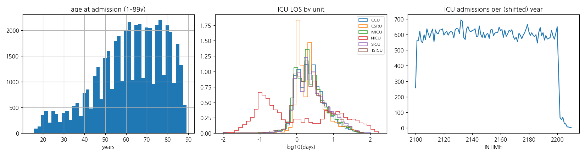
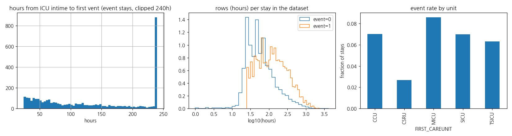
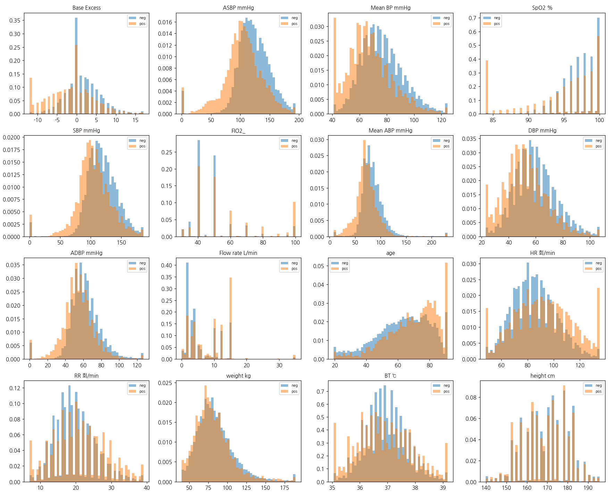
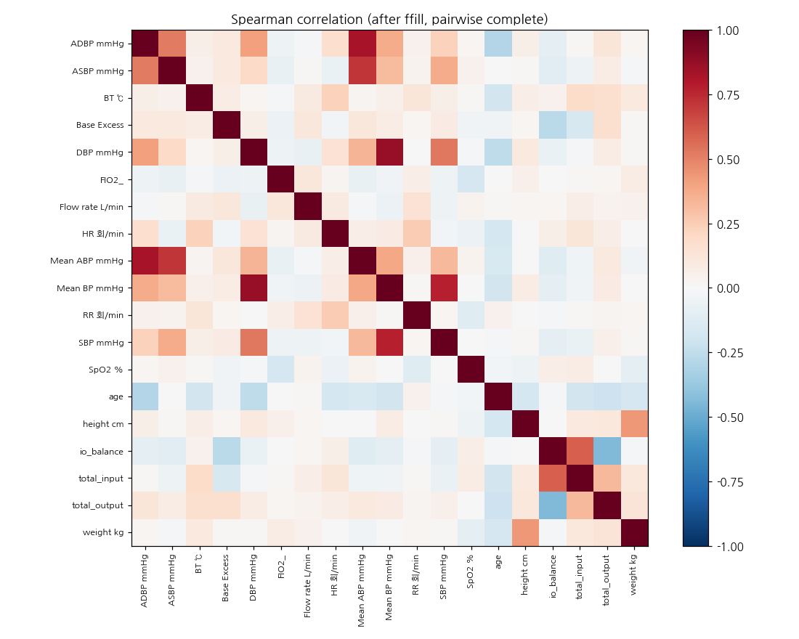
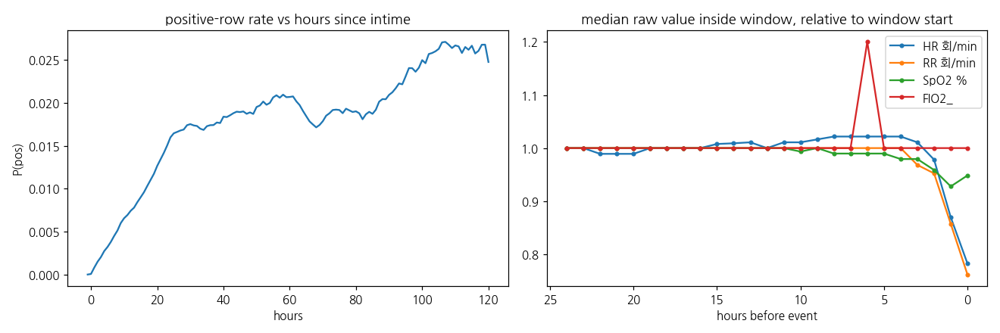

# MIMIC-III ICU ventilation dataset — EDA

## 1. MIMIC-III v1.4 raw overview
- tables: 26 csv.gz, total 6.6 GB compressed; largest CHARTEVENTS 4.3 GB, NOTEEVENTS 1.2 GB
- PATIENTS 46,520 / ADMISSIONS 58,976 / ICUSTAYS 61,532 (subjects with ICU stay 46,476)
- dates are shifted per patient into 2100–2200; DOB of >89y patients shifted −300y (age → 300+)
### admissions by age group (age at ADMITTIME)
| age_group     |   admissions |   hosp_mortality |   admissions_pct |
|:--------------|-------------:|-----------------:|-----------------:|
| neonate       |     8110.000 |            0.008 |           13.751 |
| 1-17          |      101.000 |            0.109 |            0.171 |
| 18-39         |     5054.000 |            0.054 |            8.570 |
| 40-59         |    14381.000 |            0.081 |           24.384 |
| 60-79         |    21084.000 |            0.115 |           35.750 |
| 80-89         |     7630.000 |            0.181 |           12.937 |
| >89 (shifted) |     2616.000 |            0.210 |            4.436 |
### admissions by type
| ADMISSION_TYPE   |   admissions |   hosp_mortality |
|:-----------------|-------------:|-----------------:|
| ELECTIVE         |     7706.000 |            0.026 |
| EMERGENCY        |    42071.000 |            0.129 |
| NEWBORN          |     7863.000 |            0.008 |
| URGENT           |     1336.000 |            0.121 |
### sex (PATIENTS): {'M': 26121, 'F': 20399}
### ethnicity (top 6, collapsed)
| ETHNICITY          |   admissions |
|:-------------------|-------------:|
| WHITE              |        41325 |
| BLACK              |         5785 |
| UNKNOWN            |         4523 |
| ASIAN              |         2007 |
| HISPANIC OR LATINO |         1696 |
| OTHER              |         1512 |
### in-hospital mortality: 0.099 (neonates excluded: 0.114)
### ICU stays by first care unit
| FIRST_CAREUNIT   |    stays |   subjects |   los_median_d |   los_mean_d |   age_median |   hosp_mortality |
|:-----------------|---------:|-----------:|---------------:|-------------:|-------------:|-----------------:|
| CCU              |  7726.00 |    6802.00 |           2.20 |         3.90 |        70.00 |             0.12 |
| CSRU             |  9312.00 |    8424.00 |           2.15 |         3.90 |        67.00 |             0.04 |
| MICU             | 21088.00 |   15636.00 |           2.10 |         4.01 |        64.00 |             0.16 |
| NICU             |  8100.00 |    7870.00 |           0.80 |        10.03 |         0.00 |             0.01 |
| SICU             |  8891.00 |    7695.00 |           2.25 |         4.71 |        63.00 |             0.13 |
| TSICU            |  6415.00 |    6027.00 |           2.11 |         4.44 |        59.00 |             0.12 |
| ALL              | 61532.00 |   46476.00 |           2.09 |         4.92 |        62.00 |             0.11 |
### charting system (DBSOURCE) by unit — CareVue (2001–08) vs MetaVision (2008–12) use different ITEMIDs
| FIRST_CAREUNIT   |   both |   carevue |   metavision |
|:-----------------|-------:|----------:|-------------:|
| CCU              |     19 |      4930 |         2777 |
| CSRU             |      8 |      5921 |         3383 |
| MICU             |     66 |     10752 |        10270 |
| NICU             |      0 |      8100 |            0 |
| SICU             |     30 |      4536 |         4325 |
| TSICU            |     13 |      3537 |         2865 |
### ICU stays per subject: 1 stay 37,721 subjects; 2: 5,796; 3+: 2,959

## 2. Built dataset (icu_death_w24h.csv, event = death) — cohort
### cohort flow
| step | stays |
|---|---|
| ICUSTAYS total | 61,532 |
| adult units (NICU excluded) | 53,432 |
| admissions ending in death outside this ICU stay (excluded) | 2,091 |
| with event (in-ICU death inside the stay) | 4,453 / 51,338 |
| event stays dropped: label window starts before ICU intime | 1,062 |
| **final** | **50,276** (event 3,391 = 6.7 %, subjects 36,789) |
- rows 5,091,752; label crosstab (is_event × is_pre_event):
|   is_event |     0 |       1 |
|-----------:|------:|--------:|
|          0 |     0 | 4427143 |
|          1 | 82031 |  582578 |
- training uses is_event=0 rows (negative) and is_event=1 & is_pre_event=0 rows (positive, the 8h window); is_event=1 & is_pre_event=1 rows (event stays before the window) are excluded.
### by FIRST_CAREUNIT
| FIRST_CAREUNIT   |    stays |   event_rate |   hours_to_event_median |   rows_per_stay_median |   age_median |
|:-----------------|---------:|-------------:|------------------------:|-----------------------:|-------------:|
| CCU              |  7318.00 |         0.07 |                  115.45 |                  54.00 |        69.95 |
| CSRU             |  9146.00 |         0.03 |                  147.70 |                  53.00 |        67.80 |
| MICU             | 19459.00 |         0.09 |                  118.69 |                  52.00 |        64.37 |
| SICU             |  8316.00 |         0.07 |                  118.77 |                  56.00 |        62.83 |
| TSICU            |  6037.00 |         0.06 |                  111.02 |                  53.00 |        58.69 |
### by DBSOURCE
| DBSOURCE   |    stays |   event_rate |   hours_to_event_median |   rows_per_stay_median |   age_median |
|:-----------|---------:|-------------:|------------------------:|-----------------------:|-------------:|
| both       |   121.00 |         0.14 |                  303.67 |                 111.00 |        60.01 |
| carevue    | 27852.00 |         0.07 |                  127.69 |                  57.00 |        65.21 |
| metavision | 22303.00 |         0.06 |                  108.03 |                  49.00 |        65.33 |
### by ADMISSION_TYPE
| ADMISSION_TYPE   |    stays |   event_rate |   hours_to_event_median |   rows_per_stay_median |   age_median |
|:-----------------|---------:|-------------:|------------------------:|-----------------------:|-------------:|
| ELECTIVE         |  7337.00 |         0.02 |                  145.16 |                  49.00 |        65.11 |
| EMERGENCY        | 41619.00 |         0.08 |                  118.13 |                  54.00 |        65.30 |
| URGENT           |  1320.00 |         0.08 |                  147.44 |                  62.00 |        65.71 |
### by dataset
| dataset   |    stays |   event_rate |   hours_to_event_median |   rows_per_stay_median |   age_median |
|:----------|---------:|-------------:|------------------------:|-----------------------:|-------------:|
| test      |  7496.00 |         0.06 |                  119.60 |                  53.00 |        65.45 |
| train     | 35161.00 |         0.07 |                  118.69 |                  53.00 |        65.35 |
| val       |  7619.00 |         0.07 |                  123.38 |                  53.00 |        64.65 |
### by age group / sex
|       |     stays |   event_rate |
|:------|----------:|-------------:|
| 18-39 |  4770.000 |        0.032 |
| 40-59 | 13806.000 |        0.049 |
| 60-79 | 20958.000 |        0.068 |
| 80-89 |  8329.000 |        0.104 |
| >89   |  2384.000 |        0.106 |
| F     | 21874.000 |        0.070 |
| M     | 28402.000 |        0.066 |

## 3. Features
### missingness per feature (row level, hourly grid) — raw vs after per-stay forward fill
|                 |   raw_missing_all |   raw_missing_neg |   raw_missing_pos |   after_ffill_all |   after_ffill_neg |   after_ffill_pos |   stays_ever_measured |
|:----------------|------------------:|------------------:|------------------:|------------------:|------------------:|------------------:|----------------------:|
| ADBP mmHg       |             0.537 |             0.566 |             0.437 |             0.327 |             0.349 |             0.223 |                 0.500 |
| ASBP mmHg       |             0.537 |             0.566 |             0.437 |             0.327 |             0.349 |             0.223 |                 0.500 |
| BT ℃            |             0.701 |             0.706 |             0.728 |             0.038 |             0.040 |             0.012 |                 0.980 |
| Base Excess     |             0.927 |             0.933 |             0.900 |             0.235 |             0.260 |             0.079 |                 0.585 |
| DBP mmHg        |             0.517 |             0.495 |             0.662 |             0.108 |             0.114 |             0.050 |                 0.963 |
| FIO2_           |             0.842 |             0.855 |             0.797 |             0.270 |             0.297 |             0.089 |                 0.543 |
| Flow rate L/min |             0.890 |             0.882 |             0.946 |             0.333 |             0.320 |             0.427 |                 0.821 |
| HR 회/min       |             0.088 |             0.092 |             0.109 |             0.026 |             0.028 |             0.006 |                 0.982 |
| Mean ABP mmHg   |             0.531 |             0.561 |             0.418 |             0.321 |             0.343 |             0.212 |                 0.506 |
| Mean BP mmHg    |             0.520 |             0.499 |             0.663 |             0.108 |             0.115 |             0.050 |                 0.962 |
| RR 회/min       |             0.100 |             0.104 |             0.127 |             0.027 |             0.029 |             0.006 |                 0.982 |
| SBP mmHg        |             0.517 |             0.495 |             0.661 |             0.106 |             0.113 |             0.049 |                 0.963 |
| SpO2 %          |             0.122 |             0.126 |             0.190 |             0.027 |             0.029 |             0.007 |                 0.982 |
| age             |             0.000 |             0.000 |             0.000 |             0.000 |             0.000 |             0.000 |                 1.000 |
| height cm       |             0.995 |             0.994 |             0.996 |             0.520 |             0.527 |             0.490 |                 0.445 |
| io_balance      |             0.961 |             0.961 |             0.959 |             0.134 |             0.143 |             0.043 |                 0.944 |
| sex             |             0.000 |             0.000 |             0.000 |             0.000 |             0.000 |             0.000 |                 1.000 |
| total_input     |             0.961 |             0.962 |             0.959 |             0.142 |             0.152 |             0.048 |                 0.930 |
| total_output    |             0.963 |             0.963 |             0.961 |             0.154 |             0.164 |             0.066 |                 0.915 |
| weight kg       |             0.975 |             0.975 |             0.983 |             0.128 |             0.135 |             0.062 |                 0.879 |
- HR/RR/SpO2 are charted ~hourly; BP is hourly only when arterial (A*BP) or NIBP is used; FiO2 / O2 flow are charted mostly when oxygen is delivered; weight/height/base excess/I-O are sparse events (I/O is a daily total assigned to the next day 00:00, so at most 1 row/day is non-missing).
### fraction of rows with a value, CareVue vs MetaVision (ITEMID mapping sanity check)
|                 |   carevue |   metavision |
|:----------------|----------:|-------------:|
| ADBP mmHg       |     0.514 |        0.381 |
| ASBP mmHg       |     0.514 |        0.381 |
| BT ℃            |     0.315 |        0.274 |
| Base Excess     |     0.082 |        0.059 |
| DBP mmHg        |     0.421 |        0.582 |
| FIO2_           |     0.166 |        0.144 |
| Flow rate L/min |     0.118 |        0.097 |
| HR 회/min       |     0.892 |        0.945 |
| Mean ABP mmHg   |     0.511 |        0.402 |
| Mean BP mmHg    |     0.415 |        0.584 |
| RR 회/min       |     0.874 |        0.941 |
| SBP mmHg        |     0.422 |        0.583 |
| SpO2 %          |     0.847 |        0.928 |
| age             |     1.000 |        1.000 |
| height cm       |     0.005 |        0.006 |
| io_balance      |     0.039 |        0.039 |
| sex             |     1.000 |        1.000 |
| total_input     |     0.039 |        0.038 |
| total_output    |     0.036 |        0.038 |
| weight kg       |     0.021 |        0.031 |
### value distribution, positive (label window) vs negative rows, after per-stay ffill
| feature         |   neg_median |   pos_median | neg_IQR       | pos_IQR       |   std_mean_diff |
|:----------------|-------------:|-------------:|:--------------|:--------------|----------------:|
| Base Excess     |         1.00 |        -1.00 | -1.0–4.0      | -6.0–2.0      |           -0.60 |
| ASBP mmHg       |       121.00 |       104.00 | 106.0–140.0   | 87.5–124.0    |           -0.58 |
| Mean BP mmHg    |        75.00 |        66.00 | 66.0–86.0     | 57.0–77.0     |           -0.56 |
| SpO2 %          |        98.00 |        96.00 | 96.0–99.0     | 92.0–99.0     |           -0.54 |
| SBP mmHg        |       117.00 |       103.00 | 102.5–134.0   | 90.0–121.0    |           -0.50 |
| FIO2_           |        50.00 |        50.00 | 40.0–50.0     | 40.0–70.0     |            0.49 |
| Mean ABP mmHg   |        81.00 |        71.00 | 71.0–94.0     | 61.0–83.0     |           -0.48 |
| DBP mmHg        |        58.00 |        51.00 | 49.0–69.0     | 42.0–61.5     |           -0.46 |
| ADBP mmHg       |        60.00 |        54.00 | 52.0–70.0     | 45.0–64.0     |           -0.40 |
| Flow rate L/min |         4.00 |        10.00 | 2.0–10.0      | 4.0–15.0      |            0.39 |
| age             |        64.96 |        72.17 | 52.4–76.5     | 59.3–81.5     |            0.37 |
| HR 회/min       |        84.00 |        91.75 | 73.0–96.0     | 76.0–108.0    |            0.32 |
| total_input     |      2365.00 |      2730.61 | 1385.0–3695.7 | 1619.0–4542.6 |            0.22 |
| io_balance      |       330.00 |      1236.43 | -635.9–1594.3 | 140.5–2875.3  |            0.16 |
| RR 회/min       |        19.00 |        20.50 | 16.0–23.0     | 16.0–26.0     |            0.16 |
| weight kg       |        80.80 |        77.50 | 68.0–96.6     | 65.2–92.6     |           -0.13 |
| BT ℃            |        36.94 |        36.83 | 36.4–37.4     | 36.2–37.6     |           -0.09 |
| height cm       |       170.09 |       167.82 | 162.6–177.8   | 160.0–177.8   |           -0.09 |
| total_output    |      1987.00 |      1240.00 | 1100.0–3082.0 | 545.0–2300.0  |           -0.07 |
| sex             |         1.00 |         1.00 | 0.0–1.0       | 0.0–1.0       |           -0.03 |

### strongest correlations (|rho| > 0.5)
|                                |   spearman |
|:-------------------------------|-----------:|
| ('DBP mmHg', 'Mean BP mmHg')   |      0.871 |
| ('ADBP mmHg', 'Mean ABP mmHg') |      0.821 |
| ('Mean BP mmHg', 'SBP mmHg')   |      0.777 |
| ('ASBP mmHg', 'Mean ABP mmHg') |      0.718 |
| ('io_balance', 'total_input')  |      0.596 |
| ('DBP mmHg', 'SBP mmHg')       |      0.524 |
| ('ADBP mmHg', 'ASBP mmHg')     |      0.523 |

## 4. Time structure of the labels
### positive-row rate by hours since ICU intime (training rows only)
| hrs_bin   |         rows |   pos_rate |
|:----------|-------------:|-----------:|
| 0-6       |  327703.0000 |     0.0017 |
| 6-12      |  280395.0000 |     0.0058 |
| 12-24     |  536541.0000 |     0.0111 |
| 24-48     |  766909.0000 |     0.0176 |
| 48-72     |  488547.0000 |     0.0195 |
| 72-168    |  925246.0000 |     0.0241 |
| >168      | 1183833.0000 |     0.0241 |
### raw charting rate inside the label window, by hours before the event (charting intensifies toward the event)
|   hours before event |   HR 회/min |   RR 회/min |   SpO2 % |   FIO2_ |   Flow rate L/min |
|---------------------:|------------:|------------:|---------:|--------:|------------------:|
|                0.000 |       0.485 |       0.463 |    0.345 |   0.090 |             0.018 |
|                1.000 |       0.661 |       0.636 |    0.517 |   0.098 |             0.025 |
|                2.000 |       0.803 |       0.783 |    0.674 |   0.138 |             0.037 |
|                3.000 |       0.838 |       0.815 |    0.720 |   0.142 |             0.040 |
|                4.000 |       0.872 |       0.850 |    0.763 |   0.191 |             0.052 |
|                5.000 |       0.882 |       0.865 |    0.775 |   0.194 |             0.046 |
|                6.000 |       0.892 |       0.874 |    0.794 |   0.199 |             0.050 |
|                7.000 |       0.906 |       0.886 |    0.809 |   0.192 |             0.055 |
|                8.000 |       0.912 |       0.897 |    0.826 |   0.223 |             0.055 |
|                9.000 |       0.908 |       0.891 |    0.823 |   0.208 |             0.049 |
|               10.000 |       0.912 |       0.899 |    0.836 |   0.210 |             0.054 |
|               11.000 |       0.916 |       0.902 |    0.837 |   0.200 |             0.055 |
|               12.000 |       0.925 |       0.909 |    0.852 |   0.222 |             0.059 |
|               13.000 |       0.924 |       0.911 |    0.849 |   0.216 |             0.054 |
|               14.000 |       0.931 |       0.915 |    0.864 |   0.221 |             0.056 |
|               15.000 |       0.927 |       0.911 |    0.864 |   0.224 |             0.062 |
|               16.000 |       0.937 |       0.921 |    0.878 |   0.228 |             0.067 |
|               17.000 |       0.933 |       0.920 |    0.872 |   0.232 |             0.060 |
|               18.000 |       0.935 |       0.919 |    0.871 |   0.216 |             0.060 |
|               19.000 |       0.934 |       0.917 |    0.879 |   0.215 |             0.061 |
|               20.000 |       0.941 |       0.924 |    0.888 |   0.234 |             0.063 |
|               21.000 |       0.933 |       0.917 |    0.881 |   0.242 |             0.060 |
|               22.000 |       0.942 |       0.922 |    0.892 |   0.229 |             0.059 |
|               23.000 |       0.941 |       0.925 |    0.893 |   0.228 |             0.060 |
|               24.000 |       0.944 |       0.921 |    0.897 |   0.236 |             0.073 |

## 5. Split balance (patient-level 70/15/15, seed 0)
| dataset   |         rows |      stays |   subjects |   pos_rows |   pos_rate |   event_stays |
|:----------|-------------:|-----------:|-----------:|-----------:|-----------:|--------------:|
| train     | 3145486.0000 | 35161.0000 | 25752.0000 | 57776.0000 |     0.0184 |     2389.0000 |
| val       |  700237.0000 |  7619.0000 |  5518.0000 | 12498.0000 |     0.0178 |      516.0000 |
| test      |  663451.0000 |  7496.0000 |  5519.0000 | 11757.0000 |     0.0177 |      486.0000 |
